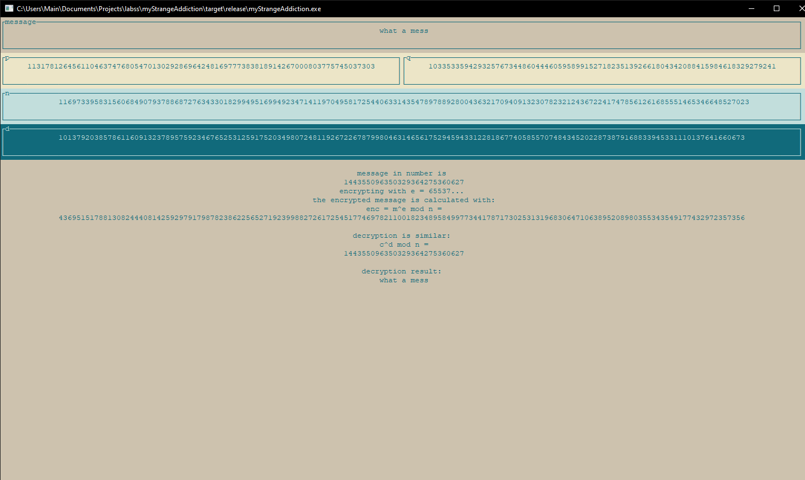
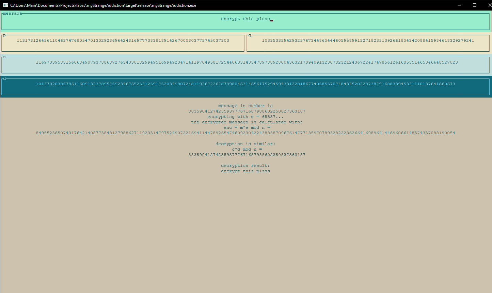
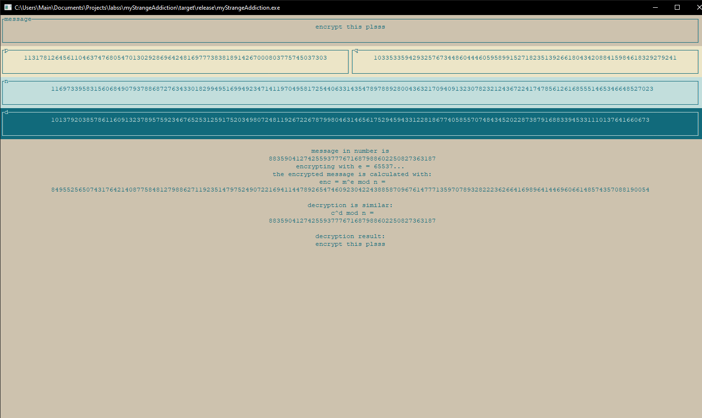

# RSA in rust 
laba for "ОИБ"\
by Kravchuk Vladislav
-------------------
\
ui usage:
* "i" to enter insert mode (change the message)
* "r" to randomise p and q
* "q" to quit the app

messy, but it works, so who cares 🪒

some screenshots:

